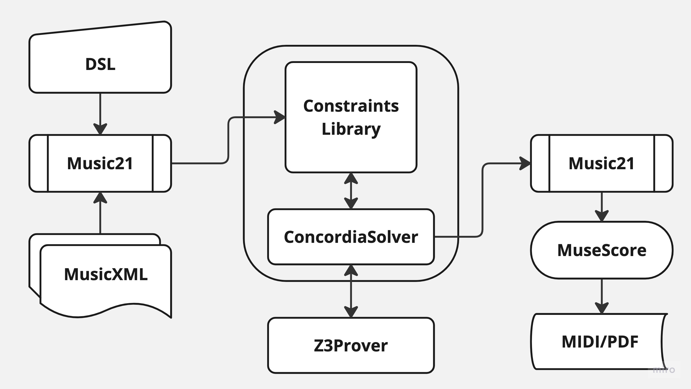

# Concordia: Music Generation Using An SMT-based Harmony Solver

## Overview
Suppose you are composing some music. You have a beautiful melody, but you don’t know what chord progression to use. We propose _Concordia_, an SMT-Based harmony-solving framework that helps composers and songwriters brainstorm musical ideas and test them out right away. Given some constraints ahead of time (e.g. baseline, melody, which chord to use), _Concordia_ will generate a harmony that satisfies the constraints. In the following sections, we will discuss the implementation of the harmony solver in more detail. This project made the following contributions:

- *Describe how musical elements can be expressed* as variables that an SMT-solver can understand.
- *Provide an extensible framework* for constructing constraints around musical constructs.
- *Provide An open-source and easy-to-install implementation* of the harmony solver, available on here on Github and as a package on [PyPI]("https://pypi.org/project/concordia-harmony/"). An quick demo can be found in `example.ipynb`.

## Supported Constraints
| Constraint          | Description                                                                                   |
|---------------------|-----------------------------------------------------------------------------------------------|
| Note specification  | Use specific notes at a certain point in the harmony.                                         |
| Chord specification | Use a specific chord/chord type at a certain position in the progression.                     |
| Chord set           | Only use chords specified to compose the harmony.                                             |
| Voice range         | Soprano cannot sing a really low note; some instruments can only play a small range of notes. |
| Voice leading       | You might want to restrict the max interval of a jump in the melody.                          |
| Chord progression   | Some chords typically do not proceed to some other chords.                                    |
| Idiomatic uses      | Some music events happen with others (e.g. cadences, voice exchange).                         |

## Architecture

## Changes
To push an update to PyPI, first update the version number in `pyproject.toml`, then push to GitHub.